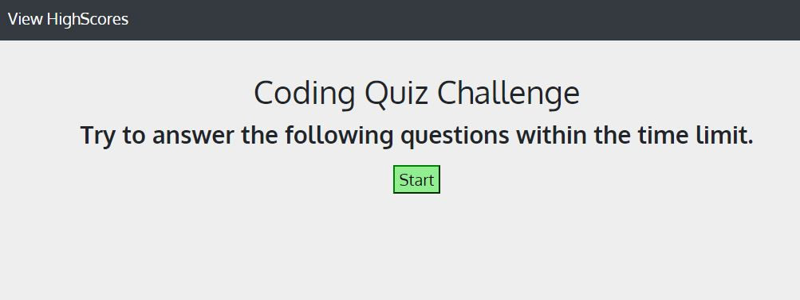
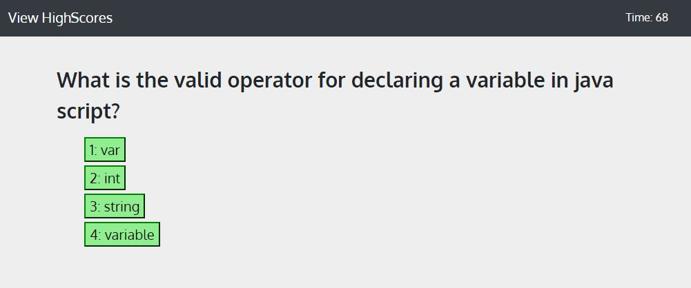
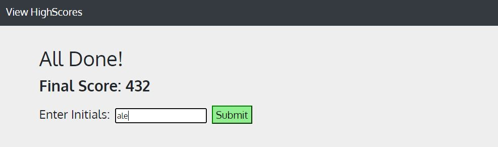
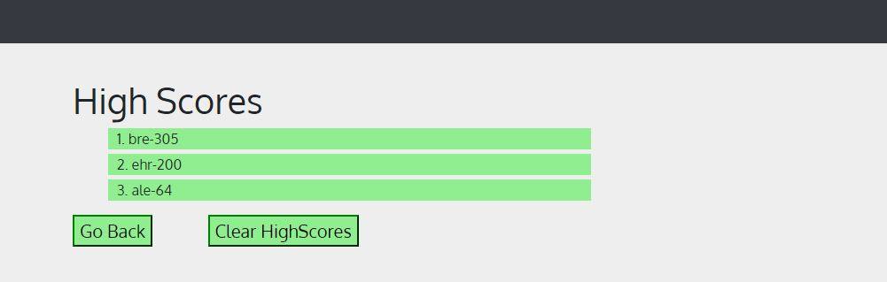

# CodeQuiz

## Table of Contents
[Description](#description)

[Installation](#installation)

[Usage](#usage)

[Credits](#credits)

## Description
This web app is a java script code quiz. When the user hits the start button they have 75 seconds to answer 5 Java Script questions. At the end of the quiz the user recives a score based on the number of question answered correctly and the time remaining. The user can then input there initials and add themselves to a local score board. This score board sorts scores from highest to lowest. This project required usage of documnent methods to create the dynamic html content.

The site appears in 4 states as follows.

### Start

### Quiz

### End

### Scores

## Installation

This repository contains all needed downloads.

## Usage
The page can be viewed at https://breakfastitem.github.io/CodeQuiz/. It can also be viewed by opening index.html with a browser.

## Credits
Author: Andrew Ehrman.

Used bootstrap components.